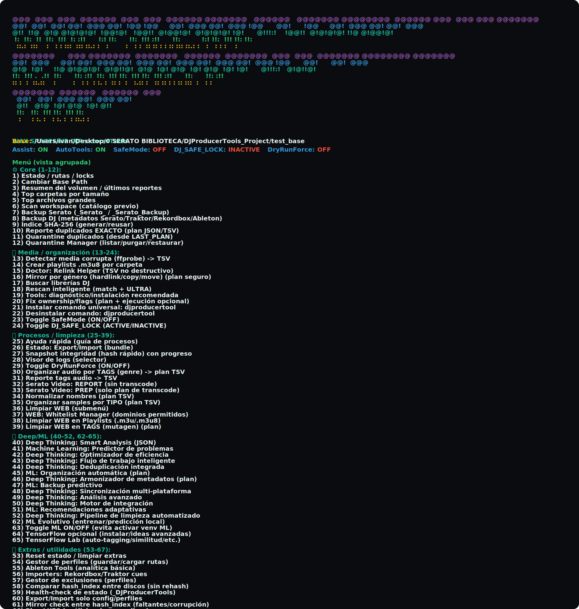
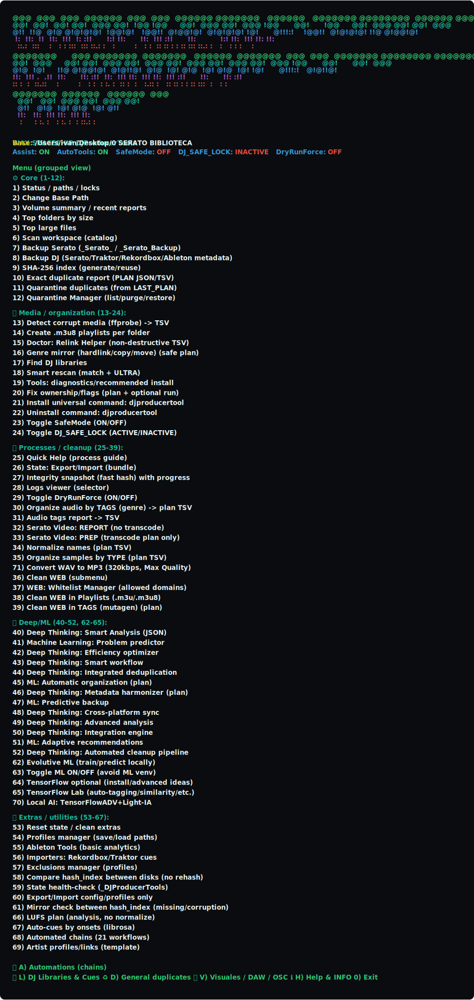

# DJProducerTools

Toolkit para limpiar, auditar y organizar librerías DJ/producer en macOS. Incluye dos scripts:

- `DJProducerTools_MultiScript_ES.sh` (español) / `DJProducerTools_MultiScript_EN.sh` (inglés).
- Capturas del menú completo:  · .

## Qué hace
- Backups seguros de Serato/Traktor/Rekordbox/Ableton y snapshots rápidos de integridad.
- Deduplicados exactos por hash con quarantine segura (plan + espacio calculado, siempre deja un KEEP).
- Limpieza de metadatos/nombres, playlists por carpeta, relink doctor, health-check de estado.
- Deep/ML opcional (análisis inteligente, eficiencia, similitud audio, TF opcional) y auto-pilot IA local (A23-A27).
- Auto-pilot (A23-A27): flujos sin intervención (prep+clean+dedup, all-in-one, clean+backup, relink doctor, deep/ML).

## Instalación rápida
```bash
cat <<'EOF' > install_djpt.sh
#!/usr/bin/env bash
set -e
for f in DJProducerTools_MultiScript_ES.sh DJProducerTools_MultiScript_EN.sh; do
  url="https://raw.githubusercontent.com/Astro1Deep/DjProducerTool/main/$f"
  curl -fsSL "$url" -o "$f"
  chmod +x "$f"
done
echo "Listo. Ejecuta ./DJProducerTools_MultiScript_ES.sh o ./DJProducerTools_MultiScript_EN.sh"
EOF
chmod +x install_djpt.sh && ./install_djpt.sh
```

## Uso básico
```bash
./DJProducerTools_MultiScript_ES.sh   # o EN para inglés
```
- Opción 2: fija tu BASE_PATH (la raíz donde está `_DJProducerTools` o tu música).  
- Menú 9→10→11: dedup exacto (hash_index → plan → quarantine).  
- Menú 27: snapshot rápido.  
- Menú 59: super doctor (espacio, artefactos, herramientas, venv ML).
- Menú A (A23–A26): auto-pilot de flujos completos.

## Rutas y estado
El estado vive en `BASE_PATH/_DJProducerTools/` (config, reports, planes, quarantine, venv). El script auto-detecta `_DJProducerTools` cercano y normaliza BASE_PATH (evita rutas duplicadas).

## Cadenas automatizadas (68 / tecla A)
- 21 flujos predefinidos (backup+snapshot, dedup+quarantine, limpieza, health scan, prep show, integridad/corruptos, eficiencia, ML básica, backup predictivo, sync multi, etc.).
## Auto-pilot IA local
- Auto-pilot (IA local / sin intervención):  
  - 23) Prep show + clean/backup + dedup multi-disco  
  - 24) Todo en uno (hash → dupes → quarantine → snapshot → doctor)  
  - 25) Limpieza + backup seguro (rescan → dupes → quarantine → backup → snapshot)  
  - 26) Relink doctor + super doctor + export estado  
  - 27) Deep/ML (hash → Smart Analysis → Predictor → Optimizer → Integrated dedup → snapshot)
  - 28) Auto-pilot seguro (reusar análisis previos + únicos + snapshot + doctor)

## Ayuda y wiki
- `GUIDE.md`: guía extensa (flujos, exclusiones, snapshots, tips).
- Menús completos: `docs/menu_es_full.svg` y `docs/menu_en_full.svg` (visibles en GitHub).

## Requisitos
- macOS con bash; acceso lectura/escritura a tus volúmenes de música/proyectos.
- Dependencias opcionales (se auto-detectan y te preguntan): ffmpeg/ffprobe, sox/flac, jq, python3.
- Perfil IA local (opción 70):  
  - **LIGHT (recomendado)**: numpy+pandas+scikit-learn+joblib+librosa.  
  - **TF_ADV (opcional, Apple Silicon)**: LIGHT + tensorflow-macos + tensorflow-metal (descarga grande).

## Licencia
DJProducerTools License (Attribution + Revenue Share). Consulta `LICENSE`.
